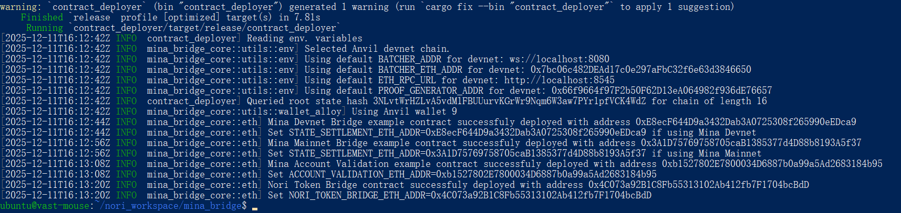
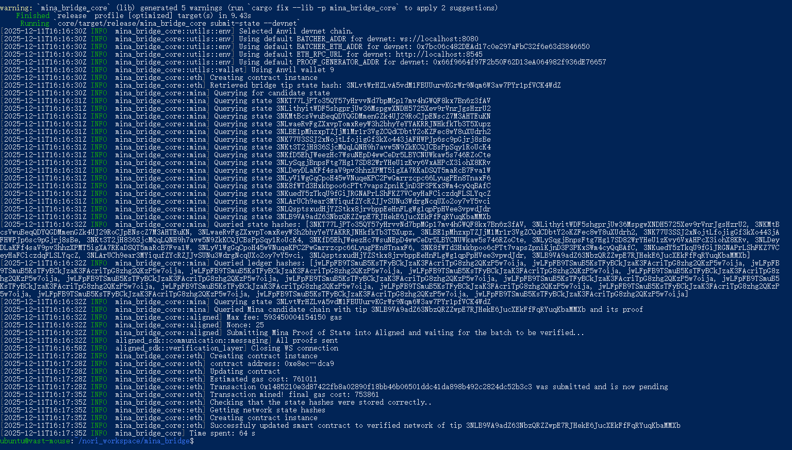
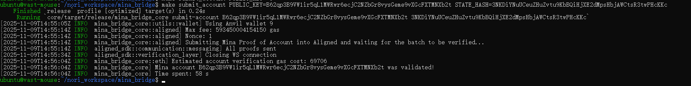
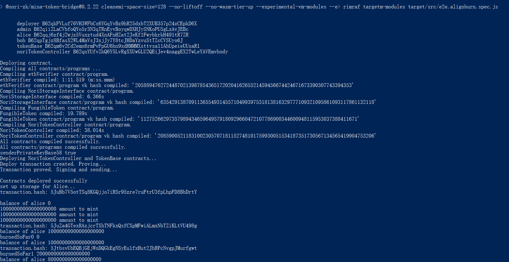
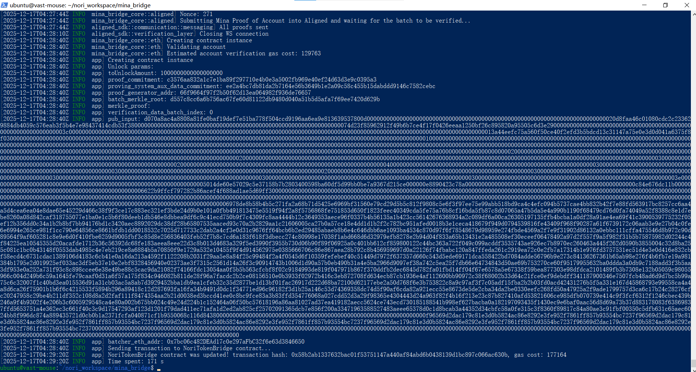

This tutorial is based on: https://github.com/Nori-zk/nori_aligned_bridge/tree/feat/token-acct-verify , only for test purpose of Nori instead of Sudoku examples.

# Step1 - Setup Mina Daemon Node & Archive Node
Now no need to setup this node, please directly use:
* Mina Daemon Node Graphql Endpoint: https://mina-node.devnet.nori.it.com/graphql/
* Mina Archive Node Graphql Endpoint: https://archive-node.devnet.nori.it.com/graphql/

Alternatively, you could use the endpoints provided by MinaScan:
* Mina Daemon Node Graphql Endpoint: https://api.minascan.io/node/devnet/v1/graphql/
* Mina Archive Node Graphql Endpoint: https://api.minascan.io/archive/devnet/v1/graphql/


# Step2 - Setup AlignedLayer Node (private net)
At the very beginning, kindly reference here for prequired installation on OS(Ubuntu 22.04.5 LTS): https://github.com/coldstar1993/nori_aligned_bridge-step-by-step/blob/main/readme.md#install-dependencies
```sh
sudo apt update

# install pkg-config, libssl-dev, g++
sudo apt install pkg-config libssl-dev g++

# install jq
sudo apt install yq

# install gvm, and go1.22.12 by gvm
bash < <(curl -s -S -L https://raw.githubusercontent.com/moovweb/gvm/master/binscripts/gvm-installer)
gvm install go1.22.12
```

1. Clone the [Aligned repo](https://github.com/yetanotherco/aligned_layer). And checkout to the `staging` branch:

```sh
git clone https://github.com/yetanotherco/aligned_layer
cd aligned_layer
git checkout staging
```

2. Install Kurtosis by following the instructions [here](https://docs.kurtosis.com/install).

3. Run:

    ```sh
    make deps
    ```

    result image:

    


4. Start Ethereum Package:

    ```sh
    make ethereum_package_start
    ```

    Now a local ethereum network boots.
    
    Let's make one pre-funded address as fee payer address when deploying smart contract within the local ethereum network: https://github.com/yetanotherco/aligned_layer/blob/cef571ee2c1557bad4212facc75800c2f386adff/network_params.yaml#L85

    ```sh
    export PRIVATE_KEY=0xac0974bec39a17e36ba4a6b4d238ff944bacb478cbed5efcae784d7bf4f2ff80
    ```

5. Start the aggregator:

    ```sh
    make aggregator_start_ethereum_package ENVIRONMENT=devnet
    ```

6. Start the batcher (needs to have docker running):

    ```sh
    make batcher_start_ethereum_package
    ```

7. Start an operator:

    ```sh
    make operator_full_registration_and_start_ethereum_package ENVIRONMENT=devnet
    ```

    result image:

    

# Step3 - Bridge a Mina account

1. Setup the `nori_aligned_bridge/.env` file of the Bridge. A template is available in `.env.template`.
    1. Set `ETH_CHAIN` to `devnet`.
    1. Set `MINA_RPC_URL` to the URL of the Mina node GraphQL API (See [Mina Daemon Node Graphql Endpoint](#step1---setup-mina-daemon-node--archive-node)).

2. In the root folder, deploy the example Bridge's contracts with:

    ```sh
    make gen_contract_abis
    make deploy_example_bridge_contracts
    ```

    The step deploys MinaAccountValidationExample.sol, MinaStateSettlementExample.sol, and NoriTokenController.sol. And for Test Purpose, NoriTokenController contract is deposited with some $ETH as simulated locked balance during its deployment.

    ```sh
    curl -X POST \
    -H "Content-Type: application/json" \
    --data '{
        "jsonrpc": "2.0",
        "method": "eth_getBalance",
        "params": ["0x**NORI_TOKEN_BRIDGE_DEVNET_ADDRESS**", "latest"],
    }' \
    http://localhost:8545
    ```

    result image:

    
  
    In the `nori_aligned_bridge/.env` file, set `STATE_SETTLEMENT_ETH_ADDR`, `ACCOUNT_VALIDATION_ETH_ADDR` and `NORI_TOKEN_BRIDGE_DEVNET_ADDRESS` to the corresponding deployed contract addresses.

3. Submit a Mina state proof to verify:

    - Run `make submit_devnet_state` if you are using Mina Devnet or `make submit_mainnet_state` if you are using Mina Mainnet.

    result image:
    
    

4. Submit an account to verify:

    ```sh
    make submit_account PUBLIC_KEY=<string> STATE_HASH=<string>
    ```

    Where:
    - `PUBLIC_KEY` is the public key of the Mina account you want to verify
    - `STATE_HASH` is the hash of a Mina state that was verified in Ethereum (You could copy the one from the log of `make submit_devnet_state`)

    result image:

    


# Step4 - Burn $ETH on Mina and Unlock it on Ethereum

1. Deploy the NoriTokenController Mina smart contract And MockMint And Burn $ETH：

    ```sh
    git clone https://github.com/Nori-zk/nori-bridge-sdk.git
    cd nori-bridge-sdk
    git checkout FEAT-AL/burn-unlock-token
    cd contracts/mina/token-bridge/
    npm run build && node --max-old-space-size=8192 --max-old-space-size=8192 --max-semi-space-size=128 --no-liftoff --no-wasm-tier-up --experimental-vm-modules --experimental-wasm-modules target/src/e2e.align_deploy_mockmint_burn.spec.js
    ```

    result image:
    
    

    In the `nori_aligned_bridge/.env` file, set `NORI_TOKEN_STORAGE_ZKAPP_ADDRESS`(as well as `NORI_TOKEN_CONTROLLER_TOKEN_ID`) to the corresponding `alice's` address.

    During test, You could mint more token and burn more token via this script:
    ```sh
    npm run build && node --max-old-space-size=8192 --max-old-space-size=8192 --max-semi-space-size=128 --no-liftoff --no-wasm-tier-up --experimental-vm-modules --experimental-wasm-modules target/src/e2e.align_mockmint_burn.spec.js
    ```

2. Unlock $ETH on Ethereum

    Let's check the current balance of NoriTokenController contract:
    
    ```sh
    curl -X POST \
    -H "Content-Type: application/json" \
    --data '{
        "jsonrpc": "2.0",
        "method": "eth_getBalance",
        "params": ["0x**NORI_TOKEN_BRIDGE_DEVNET_ADDRESS**", "latest"],
    }' \
    http://localhost:8545
    ```

    Then exec `Unlock` operation:
    ```sh
    make execute_example_unlock_nori_token
    ```

    result image:

    


    Again check the balance of NoriTokenController contract for the comparison:    
    ```sh
    curl -X POST \
    -H "Content-Type: application/json" \
    --data '{
        "jsonrpc": "2.0",
        "method": "eth_getBalance",
        "params": ["0x**NORI_TOKEN_BRIDGE_DEVNET_ADDRESS**", "latest"],
    }' \
    http://localhost:8545
    ```


